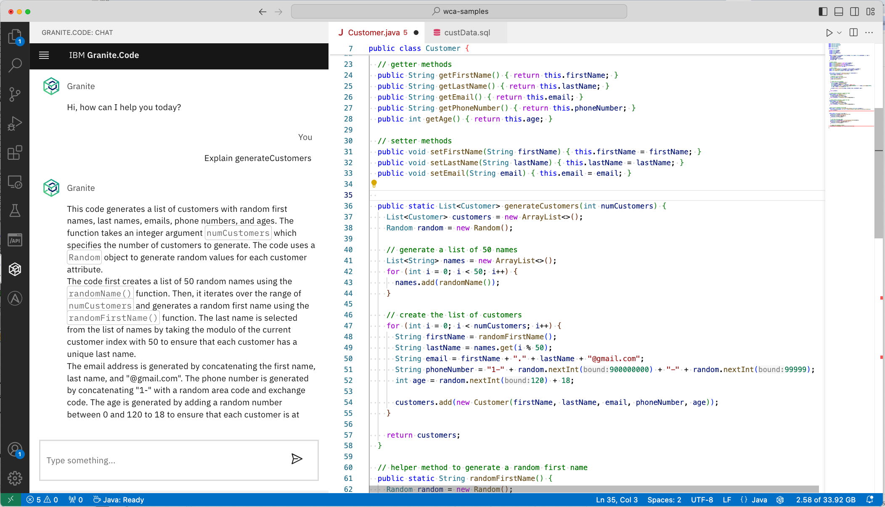
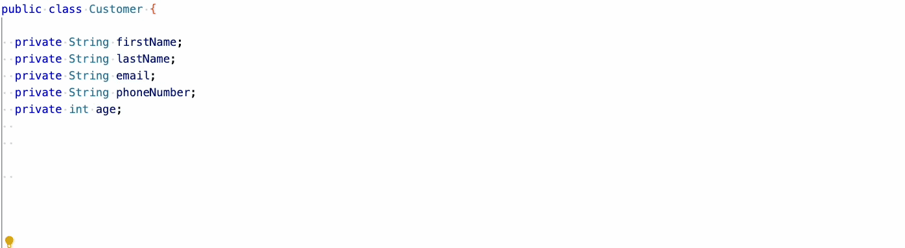
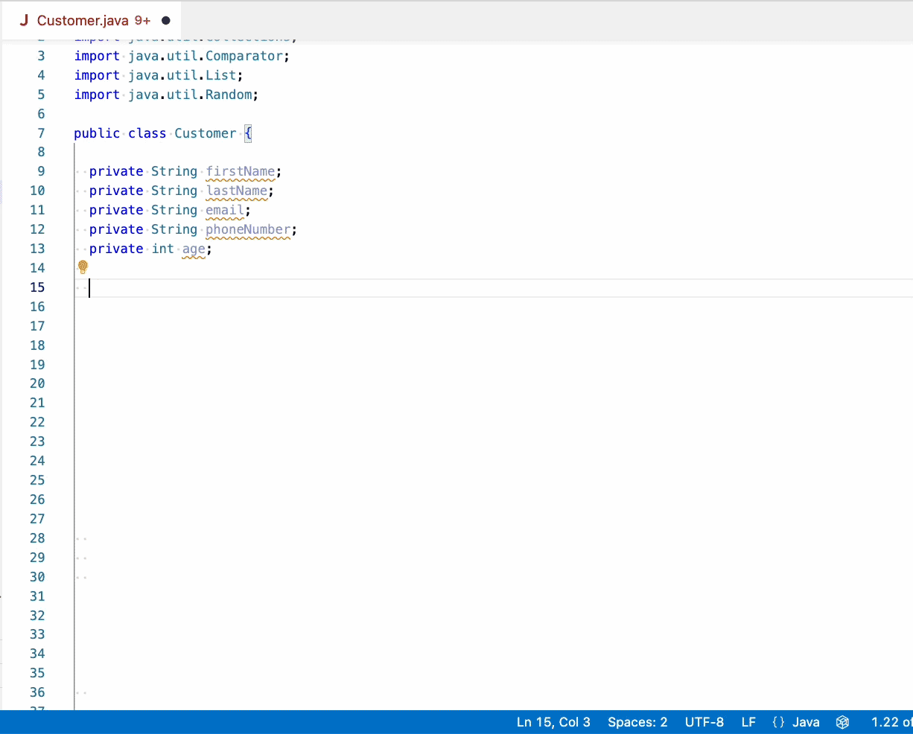
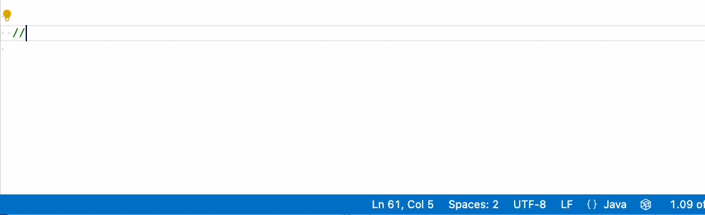
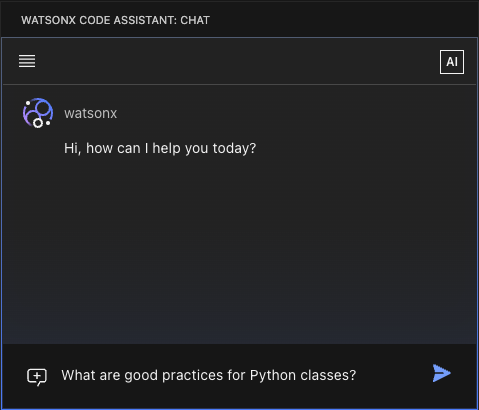
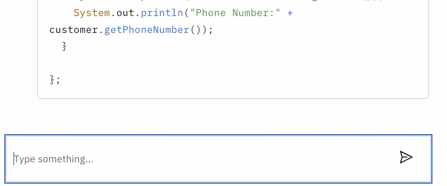
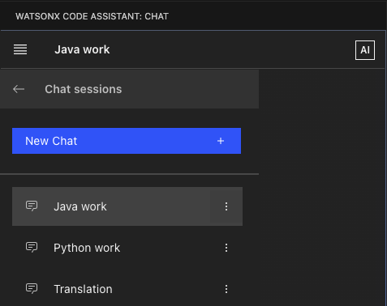

# IBM Granite.Code

## Features

IBM Granite.Code is an innovative, lightweight AI coding companion powered by IBM's state-of-the-art Granite large language model. Available at no charge, this tool offers robust, contextually aware AI coding assistance for popular programming languages including Python, Java, C/C++, JavaScript, and more. Seamlessly integrated into Visual Studio Code, Granite.Code accelerates developer’s productivity and simplifies coding tasks by providing powerful AI support hosted locally on the developer’s laptop or workstation by using Ollama.

### Chat with code models

- Chat with an [IBM Granite](https://www.ibm.com/granite) code model to create code, and ask general programming questions.
- Use the chat to explain and extend existing code from your workspace.



### Code completion

Complete the line that you're currently typing:



And even full methods and functions:



### Turn comments into code

Create a comment that describes a function, method, or piece of logic in your editor, and have IBM Granite.Code create it.



### Everything is local, configurable by you

- Pick the Granite code model to use for chat and code completion.
- All models run locally on your laptop by using [Ollama](https://ollama.com). You don't need a cloud service.

## Setup

IBM Granite.Code accesses models by using [Ollama](https://ollama.com), which is a widely-used local inferencing engine for LLMs. Ollama wraps the underlying model-serving project [llama.cpp](https://github.com/ggerganov/llama.cpp).

### Install Ollama

- MacOS, Linux, Windows: Download and run the [ollama installer](https://ollama.com/download)
- On MacOS, you can also use [homebrew](https://brew.sh/) to install Ollama:

  ```shell
  brew install ollama
  ```

### Start the Ollama inference server

In a terminal window, run:

```shell
ollama serve
```

Leave that window open while you use Ollama.

If you receive the message `Error: listen tcp 127.0.0.1:11434: bind: address already in use`, the Ollama server is already started. There's nothing else that you need to do.

### Install the Granite code model

IBM Granite.Code is tested to work with Granite models available in the [Ollama library](https://ollama.com/library/granite-code). It supports having different models for chat and code completion. But to get started, it's enough to use a single model - the `granite-code:8b`.

1. Open a new terminal window.
2. On the command line, type `ollama run granite-code:8b` to download and deploy the model. You see output similar to the following example:

   ```shell
   pulling manifest 
   pulling 8718ec280572... 100% ▕███████████████████████ 4.6 GB
   pulling e50df8490144... 100% ▕███████████████████████ ▏  123 B
   pulling 58d1e17ffe51... 100% ▕███████████████████████▏  11 KB
   pulling 9893bb2c2917... 100% ▕███████████████████████▏  108 B
   pulling 0e851433eda0... 100% ▕███████████████████████▏  485 B
   verifying sha256 digest 
   writing manifest 
   removing any unused layers 
   success 
   >>> 
   ```

3. Type `/bye` after the `>>>`to exit the Ollama command shell.
4. Try out the model by typing:

   ```shell
   ollama run granite-code:8b "How do I create a python class?"
   ```

5. You should see a response similar to the following:

   ```shell
   To create a Python class, you can define a new class using the "class" keyword followed by the name of the class and a colon. Inside the class definition, you can specify the methods and attributes that the class will have. Here is an example: ...
   ```

### Install the IBM Granite.Code extension

1. Open the IBM Granite.Code extension page in the Visual Studio Marketplace.
2. Click **Install** on the Marketplace page.
3. In Visual Studio Code, click **Install** on the extension.

### Configure the Ollama host

By default, the Ollama server runs on IP address `127.0.0.1`, port `11434`, using http as a protocol. If you change the IP address or the port where Ollama is available:

1. Open the extension settings of IBM Granite.Code.
2. Locate the entry for _API Host_.
3. Add the host IP and port.

### Configure the Granite models to use

By default, IBM Granite.Code uses the `granite-code:8b` model for both chat and code completion.
To use a different model:

1. Install the Granite model that you want to use. For more information, see [Install the Granite code model](#install-the-granite-code-model).
2. Use the command line to run `ollama list` to get the `NAME` of the model.
3. Open the extension settings of IBM Granite.Code.
4. Update the model name for either _Local Chat Model_ or _Local Code Gen Model_, or both.

_Recommendation:_ If your environment has enough capacity, install the `granite-code:8b-base` model, and use it as _Local Code Gen Model_.

### Securing your setup

#### Your Visual Studio Code environment

IBM Granite.Code does not provide any additional security controls. It's recommended the following steps be taken to properly secure your setup:

- Apply all Visual Studio Code updates to help ensure you have the latest security and bug fixes. For more information, see the [Microsoft's Documentation](https://code.visualstudio.com/docs/setup/setup-overview).
- The IBM Granite.Code extension logs are stored in *.log files under `<your home directory>/.wca`. These files are not encrypted, besides the encryption that your file system provides. Safeguard the logs against improper access.

#### Connecting IBM Granite.Code and Ollama

By default, the Ollama server runs on IP address 127.0.0.1, port 11434, using http as a protocol, on your local device. To use https instead, or go through a proxy server, follow the [Ollama documentation](https://github.com/ollama/ollama/blob/main/docs/faq.md#how-can-i-use-ollama-with-a-proxy-server).

#### Chat conversation storage

IBM Granite.Code stores all your chat conversations locally in your file system under `<your home directory>/.wca/chat.db`, in a database format defined by [SQLite](https://www.sqlite.org/index.html). IBM Granite.Code does _not_ share these conversations with anyone. This file is not encrypted, besides the encryption that your file system provides. Safeguard this file against improper access.

#### Telemetry data

IBM Granite.Code does _not_ collect any telemetry data. In general, IBM Granite.Code does not send any data that it processes to a third party, IBM included.

## Using chat with the Granite code model

### Starting the chat

1. Open the IBM Granite.Code view by selecting _View -> Open View -> IBM Granite.Code_ in the menu, or clicking the _IBM Granite.Code_ icon in the sidebar 
2. The chat panel opens to the left of the Visual Studio Code editor.
3. To move the chat, drag the icon to the right or bottom of the editor.

### Interacting with the chat

#### Use natural language

Enter a free-text question or instruction and click **Enter**. IBM Granite.Code sends your input to the code model, and shows the response in the chat.  



#### Reference code

To ask questions or refine a specific file, class, function, or method in your workspace, you can use `code references`. These references provide important context for the LLM, and can help to increase the accuracy of the answer.

1. As part of your chat message, type the `@` sign.
2. A screen pops up, showing all files, classes, and methods from your workspace.
3. Start typing the characters of the file, class, or method name you want to reference. The list filters automatically.
4. Select the reference.



IBM Granite.Code sends the contents of the reference automatically to the model as part of your message.

Chat message examples:

| Use case | Example message |
| --- | --- |
| Generate a function based on an existing function | _Create a method `send_translate_message` that is similar to @send_code_explanation_message_ |
| Generate a unit test that follows existing unit tests | _Create a unit test for @getName that is similar to the unit tests in @testLoadTablesChildConnectionReceiverJob.h_ |
| Enhance existing functions | _Add error handling and log statements to @format_documents_ |
| Enhance existing functions | _Update @setEmail with error handling for null strings_ |
| Explain code | _What does @main.py do_ |
| Explain code | _Explain the logic of @send_invoice_ |
| Generate documentation for functions and classes | _Add javadoc to @Customer_ |

##### References: Indexing your workspace

When you open a workspace folder, IBM Granite.Code creates an index of these items in memory so that you can reference these files and functions in the chat. The IDE also indexes files that you add or change during your Visual Studio Code session. The index contains up to 1000 of the most recent files in 7 programming languages: C, C++, Java, Go, JavaScript, Typescript, and Python.

#### Chat conversations

Each chat message is part of a chat conversation. We highly recommend keeping conversations focused around a specific subject or task. When you switch your context, for example, to another programming language, another project in your workspace, or a different programming task, create a new chat conversation. You get more relevant results for your questions.

To create a new chat conversation:

   1. Open the menu at the top of the chat.
   2. Select **New Chat**.

To switch between chat conversations:

   1. Open the menu at the top of the chat.
   2. Select **Chat Sessions**.
   3. Select the conversation.

To delete a chat conversation:

   1. Open the menu at the top of the chat.
   2. Select **Chat Sessions**.
   3. Select the menu on the right of the conversation.
   4. Click **Delete**.

To rename a chat conversation:

   1. Open the menu at the top of the chat.
   2. Select **Chat Sessions**.
   3. Select the menu on the right of the conversation.
   4. Click **Rename**.



#### Writing effective chat messages

- Write your chat messages in English.
- Start with a simple and clear instruction.
- Use subsequent chat messages to refine the code output of the model.
- Be as specific and detailed as you can for each step. You can gradually enhance the created code through subsequent chat messages.
- Use file and method references in your message to provide relevant context. For example, if you want the model to create a method that is similar to another method, add _"similar to `@<method>`"_ to your message.
- If you find the answers become less relevant, or if you start a new task, create a new chat conversation, and work from there. It is better to have many short chat conversations, each with a specific context, rather than one large conversation that might confuse the model with different and unrelated chat messages.

IBM Granite.Code and the Granite code models are created to answer questions that are related to code, general programming, and software engineering. The IDE doesn't restrict you in asking any kind of question, but keep in mind that the quality for nonprogramming questions isn't what you experience from noncode LLMs.

## Using in-editor code completion and comment-to-code

### Single-line completion

1. Start typing a line of code.
2. IBM Granite.Code adds a code suggestion to complete the line that you typed.
3. Press **Tab** to accept the suggestion.


### Multi-line completion

1. Start typing a line of code.
2. Press `Option` + `.`. (Mac) or `Alt`+ `.` (Windows)
3. IBM Granite.Code adds a code suggestion to complete the line that you typed, and adds code lines.
4. Press **Tab** to accept the suggestion.


### Comment-to-code

1. Type a comment.
2. Press `Option` + `.`. (Mac) or `Alt`+ `.` (Windows)
3. IBM Granite.Code adds a code suggestion based on your comment.
4. Press **Tab** to accept the suggestion.


### Tips for generating code

#### Chat for larger code blocks. Use in-editor code generation for refinement and boilerplate code

Use chat to:

- Generate the overall outline of a class
- Specify a method in detail
- Refine the suggested code by using more instructions (for example, rename or replace)

Use in-editor code generation to:

- Complete the line of code that you started to type
- Automatically create boilerplate code like getters and setters
- Create methods and code that can be described with a single comment line

#### Comment-to-code: use descriptive comments, not instructions

When you use comment-to-code in the editor, write a comment that describes the intended behavior - just like what you do when you write comments for code you wrote. For example, use `//return even numbers from an arraylist` or `//method that returns even numbers from an arraylist`. Don't write your comment as an instruction, such as `//write a method that returns even numbers from an arraylist`. Granite models are trained to complete code on data that contains many "typical", descriptive comments, so these kinds of comments yield better results.

#### Context used for in-editor code generation

The key ingredient for code generation is the context, that is, the surrounding code that you pass to the model. For in-editor code generation, IBM Granite.Code uses the following context:

1. The 20 lines of code before the line where the generation is triggered.
2. The 20 lines of code after the line where the generation is triggered.
3. Up to 200 lines from the beginning of the current file where generation is triggered.
4. Up to 5 code snippets that are similar to the code that surrounds the line where generation was triggered. These snippets are taken from the last 10 files that you opened that are in the same programming language as the current file.

To improve the results of in-editor code generation:

- Open files in your workspace that have code you want IBM Granite.Code to know about. IBM Granite.Code tries to find code in these files that is similar to the place where you trigger completion, for example, methods that use similar classes and variables, and sends this code to the model as context.
- Don’t use in-editor code generation when you start from scratch. Code generation in almost empty files might not have enough context. You can help IBM Granite.Code by starting with a class definition or adding import statements. You can also use the IBM Granite.Code chat to create the initial outline, copy the result into a file in your workspace, and continue with in-editor code generation.
